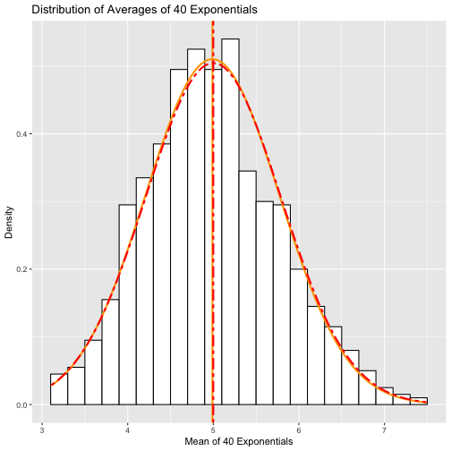

# Peer-graded Assignment: Statistical Inference Course Project

## Instruction

### The project consists of two parts:
* A simulation exercise.
* Basic inferential data analysis.

#### You will create a report to answer the questions. Given the nature of the series, ideally you'll use knitr to create the reports and convert to a pdf. (I will post a very simple introduction to knitr). However, feel free to use whatever software that you would like to create your pdf.

#### Each pdf report should be no more than 3 pages with 3 pages of supporting appendix material if needed (code, figures, etcetera).

## Part 1. A Simulation Exercise

### Load ggplot 2 and knitr libraries

```r
library(ggplot2)
```

```r
library(knitr)
```

### Setting Seed

```r
set.seed(1)
```

### Make a simuation of sample mean with the given Parameters per instruction

```r
lambda <- 0.2
n <- 40
sample_mean <- NULL
no_sim <- 1000 # Number of simulations
```


```r
for (i in 1:no_sim) {
  sample_mean <- c(sample_mean, mean(rexp(n, lambda)))
} # 1000 means of 40 expotentials
head(sample_mean)
```

```
## [1] 4.860372 5.961285 4.279204 4.702298 5.196446 4.397114
```

## Q1. Show the sample mean and compare it to the theoretical mean of the distribution.

```r
Sample_Mean <- mean(sample_mean) # Sample Mean
Sample_Mean
```

```
## [1] 4.990025
```

```r
theoretical_mean <- 1/lambda ## Theoretical Mean is 5.
theoretical_mean
```

```
## [1] 5
```

#### ANS) Sample mean mean is very close to the theoretical mean of the distribution. 

## Q2. Show how variable the sample is (via variance) and compare it to the theoretical variance of the distribution.

```r
simulation_sd <- sd(sample_mean) # Sample standard deviation
simulation_var <- var(sample_mean) # Sample variation
theoretical_sd <- 1/lambda/sqrt(n) # Theoretical standard deviation
theoretical_var <- theoretical_sd^2 # Theoretical variation

Standard_Deviation <- c(simulation_sd, theoretical_sd)
Variance <- c(simulation_var, theoretical_var)
comparison <- cbind(Standard_Deviation, Variance)
rownames(comparison) <- c("Sample", "Theoretical")
comparison
```

```
##             Standard_Deviation  Variance
## Sample               0.7817394 0.6111165
## Theoretical          0.7905694 0.6250000
```
#### ANS) We can confirm from the above table that the difference between sample standard deviation and theoretical one is minimal, and the value of the sample variation and theoretical variation is close. 

## Q3. Show that the distribution is approximately normal.
### Convert sample_mean into a data frame.

```r
df_sample_mean <- data.frame(sample_mean) # converting to a data frame
```

### Draw a plot of the distribution of a large collection (1000 simulation) of averages of 40 exponentials

```r
g1 <- ggplot(df_sample_mean, aes(sample_mean)) + 
  geom_histogram(binwidth = 0.2, aes(y = ..density..), fill = "white", col = "black") + 
  geom_vline(xintercept = Sample_Mean, size = 1, col = "orange") + 
  stat_function(fun = dnorm, args = list(mean = Sample_Mean, sd = simulation_sd), size = 1, col = "orange")
g1
```


#### ANS) We can see that the histrogram of the 1000 sample means of 40 exponentials follows the normal distribution (orange color bell curve). Its sample mean is 4.990025 and SD is 0.7817394 as described in Q1 and Q2. The sample mean is the vertical orange line.

### Add a plot of theorecticalthe distribution to the distribution of the sample means.

```r
g1 <- g1 + geom_vline(xintercept = theoretical_mean, size = 1, col = "red", linetype = "twodash") +
  stat_function(fun = dnorm, args = list(mean = theoretical_mean, sd = theoretical_sd), size = 1, col = "red", linetype = "twodash") +
  labs(x = "Mean of 40 Exponentials", y = "Density", title = "Distribution of Averages of 40 Exponentials")
g1
```



#### ANS) The theoretical mean is 5. It is the two-dashaed vertical line in red color. The two-dashed bell curve in red is the theorectical distribution. We can verity that the sample distribution (the solid line orange bell curve) is nearly a normal distribution. Its mean and SD are very close to the ones of the theoretical distribution.

