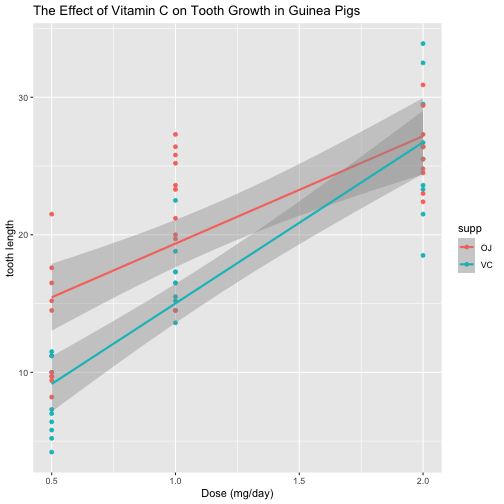

### Peer-graded Assignment: Statistical Inference Course Project

### Part 2. Basic Inferential Data Analysis Instructions

#### Overview: We are going to analyze the ToothGrowth data in the R datasets package to see if there are relationships between the tooth growth and the doses of vitamin C. 

##### Description of the dataset: The response is the length of odontoblasts (cells responsible for tooth growth) in 60 guinea pigs. Each animal received one of three dose levels of vitamin C (0.5, 1.0, and 2.0 mg/day) by one of two delivery methods, orange juice or ascorbic acid (a form of vitamin C and coded as VC).

##### Load ggplot 2 and knitr libraries

```r
library(ggplot2)
library(knitr)
```

#### Q1. Load the ToothGrowth dataset and perform some basic exploratory data analyses
##### Load the ToothGrowth Data

```r
data("ToothGrowth")
```

##### Perform some basic exploratory data analyses

```r
head(ToothGrowth)
```

```
##    len supp dose
## 1  4.2   VC  0.5
## 2 11.5   VC  0.5
## 3  7.3   VC  0.5
## 4  5.8   VC  0.5
## 5  6.4   VC  0.5
## 6 10.0   VC  0.5
```

```r
str(ToothGrowth)
```

```
## 'data.frame':	60 obs. of  3 variables:
##  $ len : num  4.2 11.5 7.3 5.8 6.4 10 11.2 11.2 5.2 7 ...
##  $ supp: Factor w/ 2 levels "OJ","VC": 2 2 2 2 2 2 2 2 2 2 ...
##  $ dose: num  0.5 0.5 0.5 0.5 0.5 0.5 0.5 0.5 0.5 0.5 ...
```

```r
summary(ToothGrowth)
```

```
##       len        supp         dose      
##  Min.   : 4.20   OJ:30   Min.   :0.500  
##  1st Qu.:13.07   VC:30   1st Qu.:0.500  
##  Median :19.25           Median :1.000  
##  Mean   :18.81           Mean   :1.167  
##  3rd Qu.:25.27           3rd Qu.:2.000  
##  Max.   :33.90           Max.   :2.000
```

##### Draw a bar chart to see how the vitamin C incurs the tooth growth.

```r
ggplot(ToothGrowth, aes(x= as.factor(dose), y = len, fill = supp)) + 
  geom_bar(stat = "identity") + facet_grid(supp~.) + labs(x = "Dose (mg/day)", y = "tooth length", title = "The Effect of Vitamin C on Tooth Growth in Guinea Pigs")
```


##### Draw a scatterplot to display the relationship per doses and per delivery methods .

```r
ggplot(ToothGrowth, aes(x= dose, y = len, col = supp)) + 
  geom_point(stat = "identity") + geom_smooth(method = "lm") + labs(x = "Dose (mg/day)", y = "tooth length", title = "The Effect of Vitamin C on Tooth Growth in Guinea Pigs")
```

```
## `geom_smooth()` using formula 'y ~ x'
```



#### Q2. Provide a basic summary of the data.
##### ANS) From the basic exploratory data analyses, we can find out followings:
- Minimum length of tooth growth is 4.20. 
- Median length of tooth growth is 19.25
- Mean length of tooth growth is 19.81
- Maximum tooth growth is 33.90. 
- Two delivery methods of the vitamin C are Orange Juice (OC) and Ascorbic Acid (VC)
- Three amount of doses (0.5, 1.0, and 2.0) are given to 60 guinea pigs.
- As we can see from the two plots on Q1, the amount of daily dose of vitamin C may stimulate the tooth growth. In addition, at the same amount of dose, Orange Juice (OC) contributes to the higher increase of tooth growth than Ascorbic Acid (VC). On the other hand, the tooth growth with VC is larger than one with OC since the slope of VC is steeper than the slope of OJ.


#### Q3. Use confidence intervals and/or hypothesis tests to compare tooth growth by supp and dose. 
- Assumption: We assume that the dataset is normally distributed. 
- We will use the **hypothesis tests** to compare tooth growth by supplement and dose.
- The given sample size is small, T distribution is preferred. 
- Confidence level is 0.95 (Significance level is 0.05)

#### 3.1. Tooth growth by supplements
##### The null hypothesis is that there is no difference between the means in teeth growth after taking two types of vitamin C supplements. 

```r
t.test(len ~ supp, data = ToothGrowth)
```

```
## 
## 	Welch Two Sample t-test
## 
## data:  len by supp
## t = 1.9153, df = 55.309, p-value = 0.06063
## alternative hypothesis: true difference in means between group OJ and group VC is not equal to 0
## 95 percent confidence interval:
##  -0.1710156  7.5710156
## sample estimates:
## mean in group OJ mean in group VC 
##         20.66333         16.96333
```

##### ANS) By comparing the outcome of the t.test, estimate tooth growth by supplements, we fail to reject the null hypothesis because the p-value (0.06063) is bigger than the 0.05 significance level.

#### 3.2. Tooth growth by doses of supplements
##### The null hypothesis is that there is no difference between the means in teeth growth after administering different doses of vitamin C. 

##### 3.2.1 Dose 0.5 mg/day

```r
t.test(len ~ supp, data = subset(ToothGrowth, dose == 0.5))
```

```
## 
## 	Welch Two Sample t-test
## 
## data:  len by supp
## t = 3.1697, df = 14.969, p-value = 0.006359
## alternative hypothesis: true difference in means between group OJ and group VC is not equal to 0
## 95 percent confidence interval:
##  1.719057 8.780943
## sample estimates:
## mean in group OJ mean in group VC 
##            13.23             7.98
```

##### ANS) By comparing the outcome of the t.test, we reject the null hypothesis because the p-value (0.006359) is smaller than the 0.05 significance level.

##### 3.2.2 Dose 1.0 mg/day

```r
t.test(len ~ supp, data = subset(ToothGrowth, dose == 1.0))
```

```
## 
## 	Welch Two Sample t-test
## 
## data:  len by supp
## t = 4.0328, df = 15.358, p-value = 0.001038
## alternative hypothesis: true difference in means between group OJ and group VC is not equal to 0
## 95 percent confidence interval:
##  2.802148 9.057852
## sample estimates:
## mean in group OJ mean in group VC 
##            22.70            16.77
```

##### ANS) By comparing the outcome of the t.test, we reject the null hypothesis because the p-value (0.001038) is smaller than the 0.05 significance level.

##### 3.2.3 Dose 2.0 mg/day

```r
t.test(len ~ supp, data = subset(ToothGrowth, dose == 2.0))
```

```
## 
## 	Welch Two Sample t-test
## 
## data:  len by supp
## t = -0.046136, df = 14.04, p-value = 0.9639
## alternative hypothesis: true difference in means between group OJ and group VC is not equal to 0
## 95 percent confidence interval:
##  -3.79807  3.63807
## sample estimates:
## mean in group OJ mean in group VC 
##            26.06            26.14
```

##### ANS) By comparing the outcome of the t.test, we fail to reject the null hypothesis because the p-value (0.9639) is bigger than the 0.05 significance level.

#### Q4. State your conclusions and the assumptions needed for your conclusions.
##### ANS) The conclusions are  
- There are differences in tooth growth at the dose of 0.5 mg/day and 1.0 mg/day after taking Orange Juice (OC) and Ascorbic Acid (VC).
- However, there is no difference in tooth growth at the dose of 2.0 mg/day. 
- We cannot find the strong evidence that one delivery method is more effective than the other.

##### Our assumption is that the whole population is normally distributed, and the population under each dose is also normally distributed.
